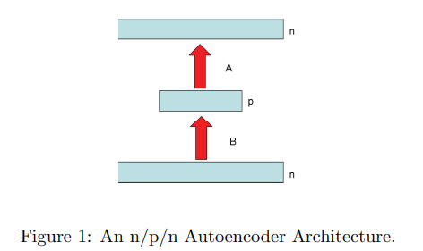
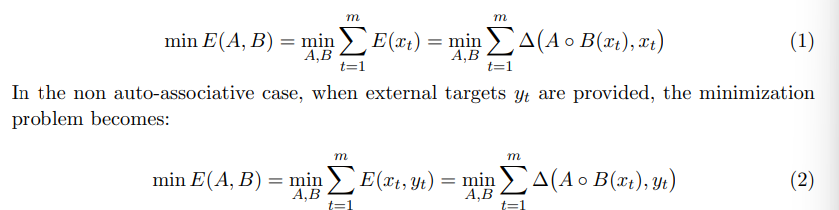
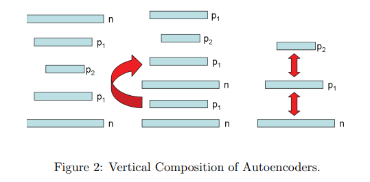

# AUTOENCODERS

> Created originally to solve the problem : **Backpropagation without Teacher** using input data as teacher

Fundamental paradigm for *UNSUPERVISED LEARNING*

## General Autoencoder Framework

An n/p/n autoencoder is defined by tuple: (n, p, m, F, G, A, B, X, delta) where

- F and G are sets
- n and p are positive integers (0 < p < n)
- A is calss of functions from Gp to Fn
- B is class of functions from Fn to Gp
- X = {x1, ...., xm} is set of m training vectors in Fn
- delta is dissimilarity or distortion function defined over Fn

For any a $\in$ A and b $\in$ B, the autoencoder transforms an input vector x $\in$ Fn into an output vector AoB(x) $\in$ Fn

The corresponding autoencoder problem is to find a $\in$ A and b $\in$ B that minimize the overall distortion function

NOTE: p < n corresponds to some form of compression or feature extraction

## Linear Autoencoder

- F and G are fields (F=G=R)
- A and B are classes of linear transformations
- So, A and B are matrices of size pxn and nxp respectively
- delta becomes euclidean distance

**1. Group Invariance:**
- Every solution is defined up to multiplication by an invertibel p x p matrix C (equivalently change of coordinates in hidden layer).
- AC-1CB = AB

**2. Problem Complexity:**
- cost function is quadratic
- operations are linear
- the overall problem: non-convex (optimization get stuck in local minima)
    - hidden layer limits the rank of overall transformation to be atmost p

**3. Fixed Layer Solution:**
- To make this problem CONVEX, fix A or B
- If A is fixed (assume A has rank p and covariance matrix is invertible), then optimum 
$$
B^{*} = B(A) = (A^{T} A)^{-1} A^{T}
$$
- If B is fixed (assume B has rank p and covariance matrix is invertible) then optimum 

$$
A^{*} = A(B) = \Sigma_{XX} B^{T} (B \Sigma_{XX} B^{T})^{-1}
$$

**4. Landscape of Reconstruction Error in Linear Autoencoders**

- The reconstruction error \(E\) in a linear autoencoder has *no local minima*, only a global minimum and saddle points.

- Critical points (where E=0) correspond to projections onto subspaces spanned by subsets of eigenvectors of the input covariance ($\sum_{XX}$).

- The *global minimum* is achieved by projecting onto the subspace spanned by the eigenvectors corresponding to the *top \(p\) eigenvalues* (Principal Component Analysis).

- All other critical points (projections onto other eigen-subspaces) are *saddle points*

- For any ordered index set $I_p$, the corresponding eigenvectors form a matrix $U_I$. The encoder A and decoder B define a critical point if there exists an invertible matrix C such that:
    - $A = U_I C$
    - $B = C^{-1} U_I^T$
    - The reconstruction $W = AB = P_{U_I}$ is the orthogonal projection onto the subspace spanned by $U_I$.

- At the global minimum (with $C=I$), the hidden layer outputs are projections of the input onto the principal eigenvectors, recovering the PCA coordinates.

- Thus, training a linear autoencoder asymptotically finds the PCA subspace minimizing reconstruction error, linking linear autoencoders and PCA closely.

**5. Clustering:**

- Global minima performs clustering by hyperplane w.r.t. to KerB (the kernel of B).
- For any given vector x, all the vectors of form x + Ker(B) are mapped to same vector y = AB(x) = AB(x+KerB)

**6. Recycling Stability:**

- At any critical points, AB is projection operator and thus recycling outputs is stable at first pass
- $(AB)^n(x) = U_I U_I^t(x)$ for any n >= 1

**7. Generalization:**

- At any critical point, for any x, AB(x) is equal to the projection of x onto the corresponding subspace and corresponding error can be easily expressed as squared distance of x to the projection space

**8. Vertical Composition:**

- Global minima of E remains same if additional matrices of rank >= p are introduced b/w input layer and hidden or hidden and output.

- Consider autoencoder n/p1/p/p1/n with p< p1 < n, Optima; solution is 
    - first compute optimal solution for n/p1/n
    - then compute optimal solution of p1/p/p1
    - combine both

    - Why? => Projection of subspace spanned by top p eigenvectors can be composed by a projection onto subspace panned by top p1 eigenvectors followed by projection onto subspace panned by top p eigen vectors

**9. External targets**

- Above works same, just $y_1 ... y_m$ become output instead of $x_1 ... x_m$

**10. Symmetries and Hebbian Rules:**

- At global minima, for C = I, A = $B_t$

## Non Linear Autoencoder

| #                           | Boolean Autoencoder Concept                                                                                                                          | Neural Network Analogy (Intuitive Explanation)                                                                                                                                               |
| --------------------------- | ---------------------------------------------------------------------------------------------------------------------------------------------------- | -------------------------------------------------------------------------------------------------------------------------------------------------------------------------------------------- |
| **1. Group Invariance**     | You can shuffle (relabel) the hidden layer’s binary codes and still get a valid solution — the meaning of each code is arbitrary.                    | You can permute or reorder hidden neurons in a neural net, and the model behaves the same — neuron labels don’t matter.                                                                      |
| **2. Problem Complexity**   | Finding the *perfect* Boolean encoder–decoder that minimizes reconstruction (Hamming distance) is extremely hard (NP-hard).                          | Finding global optima in neural networks (minimizing MSE or cross-entropy) is also hard — optimization landscapes are complex, and exact solutions are computationally intractable.          |
| **3. Fixed Layer Solution** | If the encoder is fixed, finding the best decoder is easy — and vice versa — because each can just “map” clusters or centroids optimally.            | Given encoder weights, the decoder just learns to map latent vectors back to inputs via least-squares. Or given decoder weights, the encoder learns features minimizing reconstruction loss. |
| **4. Landscape of E**       | The reconstruction error (E) surface has many local minima — multiple solutions satisfy the Boolean constraints.                                     | Neural network loss surfaces are also full of local minima and saddle points — training finds one of many approximate solutions.                                                             |
| **5. Clustering View**      | The autoencoder’s hidden layer groups input points into clusters — each hidden code corresponds to one cluster’s centroid.                           | The latent space in neural autoencoders groups similar data points near each other; encoding acts like soft clustering.                                                                      |
| **6. Recycling Stability**  | If you feed an output back into the network, it stabilizes — after one pass, it doesn’t change further.                                              | A trained autoencoder ideally reconstructs its own outputs; feeding a reconstruction again should yield the same or nearly same result (self-consistency).                                   |
| **7. Generalization**       | At good solutions, each input’s reconstruction equals its cluster’s centroid — that defines its reconstruction error.                                | In a neural AE, each encoded vector decodes to something close to the input distribution’s mean (centroid of similar inputs).                                                                |
| **8. Vertical Composition** | Adding more Boolean layers doesn’t reduce total distortion — deeper layers just re-cluster existing clusters hierarchically.                         | Stacking layers (deep autoencoders) builds hierarchical features; depth doesn’t guarantee less reconstruction error but helps form better representations.                                   |
| **9. External Targets**     | You can still use it for mapping inputs to *given targets* (not necessarily themselves). Each code’s output is the centroid of its assigned targets. | This becomes a *supervised autoencoder*: the decoder predicts labeled targets (e.g. denoising AE or encoder–decoder for translation).                                                        |
| **10. (Implied)**           | Boolean AE is the discrete case; the neural AE generalizes it with continuous values and differentiable mappings.                                    | Neural AE replaces binary lookup tables with smooth, trainable functions — enabling gradient descent learning and generalization.                                                            |

# Summary

| **Aspect**                                 | **Linear Autoencoder**                                     | **Boolean Autoencoder**                                               | **Neural (Nonlinear) Autoencoder**                         |
| ------------------------------------------ | ---------------------------------------------------------- | --------------------------------------------------------------------- | ---------------------------------------------------------- |
| **Domain / Codomain**                      | ( $F = G = R$ )                                     | ( $F = G = \{0, 1\}$ )                                                    | ( $F = G = R$ )                                     |
| **Encoder (A)**                            | ( $A(x) = W_e x$ )                                           | ( $A: \{0,1\}^n \to \{0,1\}^p )$, Boolean function (lookup table)           | ( $A(x) = f(W_e x + b_e)$ )                                  |
| **Decoder (B)**                            | ( $B(h) = W_d h$ )                                           | ( $B: \{0,1\}^p \to \{0,1\}^n )$, Boolean function (lookup table)           | ( $B(h) = g(W_d h + b_d)$ )                                  |
| **Hidden Representation (h)**              | ( $h = W_e x \in $^p$ )                             | ( $h = A(x) \in \{0,1\}^p$ )                                              | ( $h = f(W_e x + b_e) \in R^p$ )                    |
| **Reconstruction**                         | ( $\hat{x} = W_d W_e x$ )                                    | ( $\hat{x} = B(A(x)) \in \{0,1\}^n$ )                                     | ( $\hat{x} = g(W_d f(W_e x + b_e) + b_d)$ )                  |
| **Distance / Loss ( $\Delta(x, \hat{x})$ )** | ( $\|x - \hat{x}\|_2^2$ )                                      | Hamming distance ( $d_H(x, \hat{x})$ )                                  | Typically ( $\|x - \hat{x}\|_2^2$ ) or cross-entropy           |
| **Objective Function**                     | ( $\min_{W_e,W_d} \frac{1}{m}\sum_i \|x_i - W_d W_e x_i\|^2 )$ | ( $\min_{A,B} \frac{1}{m}\sum_i d_H(x_i, B(A(x_i)))$ )                  | ( $\min_{\theta} \frac{1}{m}\sum_i \Delta(x_i, B(A(x_i)))$ ) |
| **Optimization Method**                    | Analytic (SVD → PCA)                                       | Combinatorial (NP-hard)                                               | Gradient descent (backpropagation)                         |
| **Structure Type**                         | Linear mappings (matrix products)                          | Discrete logic tables (binary mappings)                               | Nonlinear differentiable functions                         |
| **Geometry / Clustering**                  | Projects data to a linear subspace (PCA directions)        | Clusters inputs into  ( $2^p$ ) binary groups (Voronoi regions)         | Forms smooth nonlinear manifolds in latent space           |
| **Complexity**                             | Polynomial, closed-form                                    | NP-hard (exponential search)                                          | Non-convex, tractable by gradient descent                  |
| **Fixed layer property**                   | If ($W_e$) fixed → least-squares $(W_d)$                       | If (A) fixed → direct cluster-centroid (B)                            | If encoder fixed → decoder solves regression               |
| **Recycling Stability**                    | ( $W_d W_e W_d W_e x = W_d W_e x$ ) (idempotent)             | ( $AB(AB(x)) = AB(x)$ )                                                 | ( $B(A(B(A(x)))) \approx B(A(x))$ )                          |
| **Vertical Composition**                   | Adding layers = equivalent to PCA subspace composition     | Adding Boolean layers = hierarchical clustering (no lower distortion) | Adding layers = hierarchical feature extraction (deep AE)  |
| **With Targets ($y_i$)**                     | Can fit $(B(A(x_i)) \approx y_i)$ (regression)               | $(B(A(x_i)))$ = majority of targets mapped to same code                 | Supervised encoder–decoder (translation, denoising, etc.)  |
| **Interpretation**                         | Linear projection + reconstruction                         | Binary codebook + lookup reconstruction                               | Continuous nonlinear encoding + decoding                   |
| **Outcome**                                | Learns global linear structure                             | Learns optimal binary partition                                       | Learns smooth latent manifold (nonlinear PCA)              |

