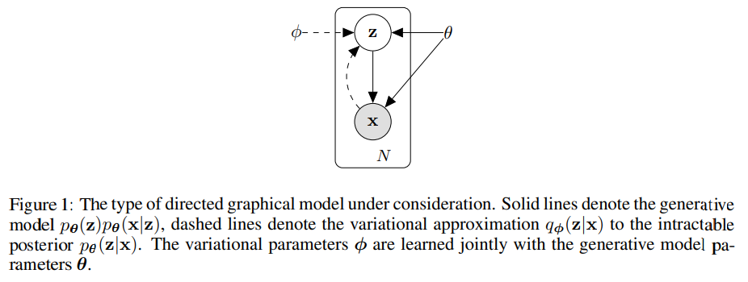
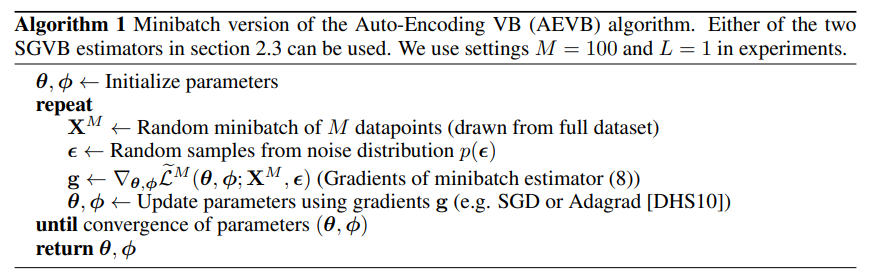
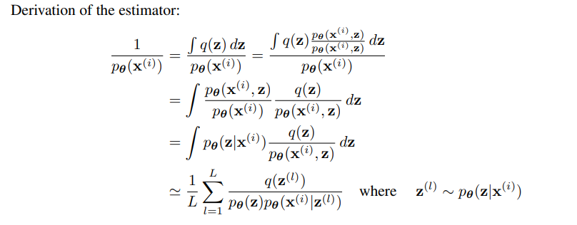
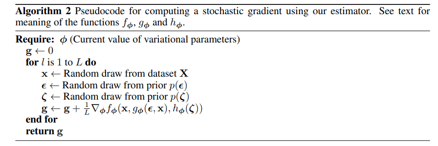

# Variational Autoencoders

## Motivation

**How can we perform efficient inference and learning in directed probabilistic models, in the presence of continuous latent variables with intractable posterior distributions and large datasets?**

- Directed Probabilistic Models ⇒ Bayesian/Generative models where arrows show how variables cause each other.
- Continuous Latent Variables ⇒ Hidden variables (not observed) that are real-valued.
- Intractable Posterior Distribution ⇒ -   The “true”  $p(z∣x)$  is too hard to compute exactly (integrals too nasty).

In simple terms, When we have a big generative model with hidden continuous variables, and the exact math to infer those hidden variables is impossible, and we also have tons of data, how can we still approximately infer the hidden stuff and train the model quickly?

## Solution Brief

**Variational Bayesian (VB)**: involves optimization of an approximation to the intractable posterior distributions. 

- Simply put, 
	- The true posterior  $p(z∣x)$  is too hard to compute.
	- So VB picks an easier distribution  $q(z)$  and  tunes  it to be close to  $p(z∣x)$
	- This tuning is an optimization problem

But Common Mean-Field approaches requires analytical solutions of expectations w.r.t. the approximate posterior, which are also intractable in the general case.

- This means, 
	- Mean Field Trick : -   To keep  $q(z)$  simple, we assume independence between parts of  $z$:  $q(z) = \prod_i q_i(z_i)$. This is Mean-Field Approximation
	- To update each $q_i$,  formulas usually involve expectations like $E_{q(z)} [some function ]$
	- For many realistic models, these expectations  **don’t have closed-form formulas**  → again too hard (intractable).

To address this
- A reparameterization of the variational lower bound yields a simple differentiable unbiased estimator of the lower bound.
- This Stochastic Gradient Variational Bayes can be used for efficient approximate posterior inference in almost any model with continuous latent variables and parameters, and is straightforward to optimize using standard SGD 
- For i.i.d dataset and continuous latent variables per datapoint ⇒ Auto-Encoding VB (AEVB)
- In AEVB setup, we make inference and learning faster by using the SGVB (Stochastic Gradient Variational Bayes) estimator. This method trains a recognition model that can quickly approximate the posterior distribution using simple sampling steps, instead of running slow, complex inference for every data point.
- This learned approximate posterior inference model can also be used for 
	- Recognition
	- Denoising
- When neural net used for recognition model ⇒ **VARIATIONAL AUTOENCODER**

## Deriving a Lower Bound Estimator

MAP (Maximum A Posteriori) and ML (Maximum Likelihood) are both used to estimate model parameters, but they are applied in different scenarios depending on the need for prior information and regularization.

- *Maximum Likelihood*: Used when you want to find the parameter values that make the observed data most probable, without considering any prior beliefs about the parameters.
	- Used when you have a lot of data and want the model to fit the data as closely as possible.

- *Maximum A Posteriori*: Used when you want to include prior knowledge or assumptions about the parameters, such as regularization or domain expertise.
	- Combines the likelihood of the data with a prior distribution over the parameters, making it especially useful when data is limited or noisy, as it helps prevent overfitting.

- *Variational Inference*: Transforms the problem of computing an intractable posterior distribution into an optimization problem, where it finds a simpler, parameterized distribution that is close to the true posterior.

> Restricted to common case of i.i.d. dataset with latent variables per datapoint, and where we like to perform maximum likelihood (ML) or maximum a posteriori (MAP) inference on the (global) parameters, and variational inference on latent variables.

We can thus extend this scenario to case where we also perform variational inference on global params.

## Problem Scenario

Dataset $X = {x^{(i)}}$ consisting of N i.i.d samples of some continuous or discrete variable x.

Assume data generated by some random process involving an unobserved continuous random variable $z$

*Process*

- Step 1: A value $z^{(i)}$ is generated from some prior distribution $p_{\theta^*} (z)$
- Step 2: A value $x^{(i)}$ is generated from some conditional distribution $p_{\theta^*} (x|z)$

So data distribution arises from integrating the hidden variable $p_{\theta^*}​(x) = \int p_{\theta^*}​(x|z) p_{\theta^*}​(z) dz$

Assume prior $p_{\theta^*} (z)$ and likelihood $p_{\theta^*} (x|z)$ come from parametric families of distributions $p_{\theta} (z)$ and $p_{\theta} (x|z)$ and their PDFS are differentiable almost everywhere w.r.t to both $\theta$ and z. 

> Parametric Families: Instead of saying “the prior is exactly this Gaussian” or “the likelihood is exactly this distribution”, the assumption is: prior $p_{\theta^*} (z)$ belongs to some family $p_{\theta} (z)$ and likelihood $p_{\theta^*} (x|z)$ belongs to some family $p_{\theta} (x|z)$. The symbol $\theta$ is the tunable parameter vector that specifies which member of each family is chosen.  The real world used some true parameter $\theta^*$, but you *do not know* it.

> The PDFs are differentiable in both $\theta$ and $z$.  This assumption is not just a technicality, it is the reason we can do: GD optimization, EM algorithm, variational inference and backpropagation in latent-variable models. Without differentiability, these methods fail or become intractable.

But lot of this process is hidden from our view: the true params $\theta^*$ as well as the values of the latent variables $z^{(i)}$ are unknown to us

> We don't know $\theta^*$ and $z^{(i)}$, so we can't calculate complete data likelihood $p_{\theta}​(x^{(i)}, z^{(i)})$ because half of it's input don't exist for us. So we work on marginal likelihood $p_{\theta}​(x^(i)) = \int p_{\theta}​ (x^{(i)} , z) dz$. This is usually intractable, hence the need for EM or variational inference.

Important: We do not make simplifying assumptions about the marginal or posterior probabilities (each term independent from other, making it simple product)

We need algorithm that works even in the cases of:

- *Intractability*: 
	- The integral of marginal likelihood $p_{\theta}​(x^{(i)}) = \int p_{\theta}​ (x^{(i)} , z) dz$ is intractable (we cannot evaluate or differentiate the marginal likelihood) 
	- True posterior density $p_{\theta} (z|x) = p_{\theta} (x|z) p_{\theta} (z) / p_{\theta} (x)$ is intractable (EM algorithm cannot be used)
	- Required integrals for any reasonable mean-field VB algorithm are also intractable

> These intractabilities are common eg. neural net with nonlinear hidden layer.

- *Large Dataset*:
	- We have so much data that batch optimization is too costly
	- We would like to make parameter updates using small minibatches or even single points
	- Sampling based solutions (Monte-Carlo, EM) would be too slow, since it involves a typically expensive sampling loop per datapoint.

**3 related problems**

- Efficient approximate ML or MAP for the parameters $\theta$, The parameters can be of interest themselves(if we are analyzing some natural process (real process behind generating the data) as they might reveal the underlying structure of how the real system behaves.). They also allow us to mimic the hidden random process and generate artificial data that resembles the real data.

- Efficient approximate posterior inference of the latent variable z given an observed value x for a choice of parameters $\theta$. Useful for coding or data representation tasks.

- Efficient approximate marginal inference of the variable x. Allows to perform all kinds of inference tasks where a prior over x is required. Eg, Image Denoising, Impainting, Super-Resolution.

**To solve these problems**

We introduce a recognition model $q_\phi (z | x)$ , which is an approximation to the intractable true posterior $p_\theta (z | x)$

In contrast with the approximate posterior in mean-field variational inference, parameters $\phi$ are not computed from some closed form expectation.

Instead, we use method of learning the recognition model parameters $\phi$ jointly with the generative model parameters $\theta$

The unobserved variable **z** have ab interpretation as latent representation or *code*

Can refer the recognition model $q_\phi (z | x)$ as a **probabilistic encoder** since given a datapoint **x** it produces a distribution over the possible values of the code **z** from which the datapoint **x** could have been generated.

Can refer the $p_\theta (x | z)$ as  **probabilistic decoder** sine given a code **z** it produces a distribution  over all possible corresponding values of  **x**.

## Variational Bound

> Likelihood: Probability of the observed data given the model parameters. $L( \theta | x ) = p_\theta (x)$. Here x is fixed (data we observed) and $\theta$ is variable (the thing we want to estimate). In short, Likelihood tells you **how well a parameter setting explains your data**.

> Marginal Likelihood: Probability of the observed data after integrating out latent variables. $p_\theta (x) = \int p_\theta (x, z) dz = \int p_\theta (x|z) p_\theta (z) dz$. In short, we don’t know the hidden variable z, so you “marginalize it out” (integrate it out).  
This gives the probability of the data under the full model.

### KL-Divergence: 

Measures how different one probability distribution is from another. 

- Given 2 distributions:
	- $q(z)$: approximate distribution
	- $p(z)$: true distribution

- KL Divergence is given as: $KL(q || p) = \int q(z) \, log \, (q(z) / p(z)) dz$

- KL basically says: How much more surprised would I be if I believed p but the world actually follows q?
	- This surprise is approximately $-log\, (p(z))$
	- KL measures the extra surprise averaged over all events under q.

- KL is zero if both distributions are same as log 1  = 0, otherwise KL is strictly positive.
- KL is asymmetric $KL(q || p) \ne KL(p || q)$

- To summarize: KL divergence measures how inefficient it would be to use one distribution to represent or approximate another.

---

### Bound Explaination

Marginal Likelihood is composed of a sum over the marginal likelihoods of individual datapoints  $log  p_\theta ( x^{(1)}, . . . ,x^{(N)}) = \sum_{i=1}^N log p_\theta(x^{(i)})$ which can be rewritten as 

$$
log p_\theta(x^{(i)}) =  D_{KL} (q_\phi (z | x^{(i)}) || p_\theta (z | x^{(i)})) + L(\theta, \phi; x^{(i)})
$$

First RHS term: KL-divergence of the approximate true posterior.

Since KL-divergence is non-negative, the second term is the **variational lower bound (ELBO - Evidence Lower Bound)** on the marginal likelihood of datapoint $i$.

> Since KL $\ge$ 0, $log p_\theta(x^{(i)})  \ge  L(\theta, \phi; x^{(i)})$

This variational lower bound can be written in 2 forms:

**1. Joint-Entropy Form**

$$
L(\theta, \phi; x^{(i)}) = \mathbb{E}_{q_\phi (z | x)} [-log \, q_\phi (z | x ) + log \, p_\theta (x, z) ]
$$

- One part rewards model for fitting the joint distribution $p_\theta (x, z)$.
- One part penalizes overly concentrated/complex approximate posteriors (the −log q term).

**2. Reconstruction + Regularization Form**

$$
L(\theta, \phi; x^{(i)}) = - D_{KL} (q_\phi (z | x^{(i)}) || p_\theta (z))  + \mathbb{E}_{q_\phi (z | x^{(i)})} [ log \, p_\theta (x^{(i)} | z) ]
$$

- Terms reorganized
- Basically KL to the prior and the expected log likelihood.
- Reconstruction term: how well latent samples explain the data
- KL term: how far the approximate posterior deviates from the prior

### Goal

We want to differentiate and optimize the lower bound $L(\theta, \phi; x^{(i)})$ w.r.t to both the variational parameters (parameters of the approximate posterior) $\phi$ and the generative parameters (parameters of the generative model) $\theta$

Thus, we are trying to optimize:

For one datapoint $x^{(i)}$, the lower bound or ELBO is

$$
L(\theta, \phi; x^{(i)}) = \mathbb{E}_{q_\phi (z | x^{(i)})} [-log \, q_\phi (z | x^{(i)} ) + log \, p_\theta (x^{(i)}, z) ]
$$

### Issue

**1. Graident w.r.t. $\theta$ ==> **NO ISSUE****

When differenciating wrt $\theta$ 

$$
\nabla_\theta L = \mathbb{E}_{q_{\phi(z|x)}} [ \nabla_\theta log \, p_\theta (x, z)]
$$

Here:
- The expectation is over ${q_{\phi(z|x)}}$
- $q_\phi$ does not depend on $\theta$

So the gradient passes cleanly through the expectation. This part is straightforward.

**2. Gradient w.r.t $\phi$**

Now consider

$$
\nabla_\phi L = \nabla_\phi \mathbb{E}_{q_\phi (z)} [f(z)]
$$

where

$$
f(z) = log \, p_\theta (x, z) - log \, q_\phi (z|x)
$$

Core Issue: The distribution we are averaging over, $q_\phi (z | x)$, itself depends on $\phi$

This mean:
- you are differentiating through a probability distribution
- you cannot just move $\nabla_\phi$ inside the expectation

### Solution

To handle this dependency, we use the identity

$$
\nabla_\phi \mathbb{E}_{q_\phi (z)} [f(z)] = \mathbb{E}_{q_\phi (z)} [f(z) \nabla_{q_\phi (z)} log \, q_\phi (z) ]
$$

This is mathematically exact and comes from 

$$
\nabla_\phi q_\phi (z) = q_\phi (z) \nabla_\phi log \, q_\phi (z)
$$

So the ELBO w.r.t. $\phi$ becomes as expectation of product

Since this expectation cannot be analytically solved, we approximate it with samples (Monte-Carlo)

$z^{(l)}$ ~ $q_\phi (Z|x)$

and estimate

$$
\nabla_\phi {L} \approx f(z^{(l)}) \nabla_{q_\phi (z^{(l)})} log \, q_\phi (z^{(l)}) 
 $$

**But Why does this estimator has high variance**

- f(z) is highly variable under ELBO
    - In ELBO, $f(z) = log \, p_\theta (x, z) - log \, q_\phi (z|x)$, this quantity:
        - changes drastically depending on how well z explains x
        - can be very large or very small as no built in normalization.

- Gradient term amplifies randomness
    - $\nabla_\phi log \, q_\phi (z)$ measures how sensitive the probability of sampled z is to $\phi$
    - This term varies strongly across samples and can be large for low-probabilites or boundary samples

- Estimator is product of 2 random terms
    - $f(z)$ and $\nabla_\phi log \, q_\phi (z)$ represent random magnitude and random direction respectively
    - Even if each term individually have moderate variance, product typically has higher variance

**Why does this problem occur though?**

Because:
- ELBO involves an expectation over a learned distribution
- That distribution depends on the parameters being optimized
- The only general gradient identity introduces a noisy multiplicative term

So the high variance is structural, not accidental.

## Stochastic Gradient Variational Bayes (SGVB) and Auto-Encoding Variational Bayes (AEVB)

We introduce a practical estimator of lower bound and it's derivatives wr.r.t the parameters

Assume approximate posterior in form $q_\phi(z|x)$, can also be applied to $q_\phi(z)$ (x not conditioned)

Under certain conditions (later), for a chosen approximate posterior $q_\phi(z|x)$, we can reparameterize the random variable  $\tilde z ~ q_\phi(z|x)$ using a different transformation $g_\phi (\epsilon, x)$ of an auxillary noise variable $\epsilon$

This means, randomness is moved to $\epsilon$ which does not depend on $\phi$, thereby making z a deterministic function of $(\epsilon, x, \phi)$

$$
\tilde z = g_\phi (\epsilon, x) ; \epsilon \, \isin \, p(\epsilon)
$$

This expectation $\mathbb {E}_{q_\phi (z | x^{(i)})} [f(z)] = \mathbb {E}_{p(\epsilon)} [f(g_\phi(\epsilon, x^{(i)}))]$ is over a fixed distribution $p(\epsilon)$, so gradients wrt $\phi$ can pass through $g_\phi$ using standard backprop, totally avoiding the high variance estimator.

We can now form Monte Carlo estimates of f(z) expectation w.r.t  $q_\phi(z|x)$ as follows:

### SGVB Version A

Plugging above into ELBO

$$
\mathbb {E}_{q_\phi (z | x^{(i)})} [f(z)] = \mathbb {E}_{p(\epsilon)} [f(g_\phi(\epsilon, x^{(i)}))] \approx \frac {1}{L} \sum_{l=1}^L f(g_\phi(\epsilon^{(l)}, x^{(i)})) 
$$
- where $\epsilon^{(l)} \, \isin \, p(\epsilon)$

This is now, low variance, differentiable and compatible with SGD

We can thus use this to get variational lower bound thereby yielding **Stochastic Gradient Variational Bayers (SGVB)** estimator $\tilde L^A (\theta, \phi; x^{(i)}) \approx L (\theta, \phi; x^{(i)})$

$$
\tilde L^A (\theta, \phi; x^{(i)}) = \frac {1}{L} \sum_{l=1}^L log \, p_\theta (x^{(i)}, z^{(i, l)}) - log \, q_\phi (z^{(i, l)} | x^{(i)})
$$

- $z^{(i,l)} =  g_\phi(\epsilon^{(i, l)}, x^{(i)})$
- $e^{(l)}$ ~ $p(\epsilon)$

Meaning
- Stochastic: Uses samples
- Gradient: Differentiable
- Variational: optimizes ELBO
- Bayes: Approximates posterior

### SGVB Version B

In most cases, KL divergence $D_{KL} (q_\phi (z | x^{(i)}) || p_\theta (z))$ can be integrated analytically leaving only the expected reconstruction error $\mathbb{E}_{q_\phi (z | x^{(i)})} [ log \, p_\theta (x^{(i)} | z) ]$ requires estimation by sampling.

Proof:

Consider both prior $p_\theta (z) = \mathcal {N} (0, I)$ and the posterior approximation $q_\phi (z | x^{(i)})$ are Gaussian

Let J be dimensionality of z

Let $\mu$ and $\sigma$ denote the variational mean and standard deviation evaluated at datapoint $i$

Let $\mu_j$ and $\sigma_j$ denote the j-th element of these vectors

Then

$$
\int q_\theta (z) log \, p (z) dz = \int (\mathcal {N} (z; \mu, \sigma^2) log \, \mathcal {N} (z; 0, I) dz = - \frac {J} {2} log (2\pi) - \frac {1}{2} \sum_{j=1}{J} (\mu_j^2 + \sigma_j^2)
$$

And

$$
\int q_\theta (z) log \, q_\theta (z) dz = \int \mathcal {N} (z; \mu, \sigma^2) log \, \mathcal {N} (z; \mu, \sigma^2) dz = - \frac {J} {2} log (2\pi) - \frac {1}{2} \sum_{j=1}{J} (1 + log \, \sigma_j^2)
$$

Therefore:
$$
D_{KL} ((q_\phi (z) || p_\theta (z)) = \int q_\theta (z) (log \, p_\theta (z) - log \, q_\theta (z)) dz = \frac {1}{2} \sum_{j=1}{J} (1 + log \, \sigma_j^2) - (\mu_j)^2 - (\sigma_j)^2)
$$

When using a recognition model $q_\phi (z|x)$, then $\mu$ and $\sigma$ are simply functions of x and variational parameters $\phi$

Thus, we can then interpret KL-divergence term as regularizing $\phi$ encouraging the approximate posterior  to be close to prior $p_\theta(z)$

This yields second version of SGVB estimator which has less variance than generic estimator making it the standard VAE objective

$$
\tilde L^B (\theta, \phi; x^{(i)}) = - D_{KL} (q_\phi (z | x^{(i)}) || p_\theta (z))  +  \frac {1}{L} \sum_{l=1}^L ( log p_\theta (x^{(i)} | z^{(i, l)}))
$$

- $z^{(i,l)} =  g_\phi(\epsilon^{(i, l)}, x^{(i)})$
- $e^{(l)}$ ~ $p(\epsilon)$

### Mini Batch estimator over the dataset

Given multiple datapoints from dataset X with N datapoints, we can construct an estimator of the marginal likelihood lower bound on the full dataset based on mini-batches:

$$
L(\theta, \phi; X) \approx \tilde L^M (\theta, \phi; X^M) = \frac {N}{M} \sum_{i=1}^M \tilde L (\theta, \phi; x^{(i)})
$$
- $X^M = \{ x^{(i)} \}_{i=1}^M$ is a randomly drawn sample of M datapoints from a full dataset X with N datapoints.
- Found that number of samples (L) per datapoint can be set to 1 as long as the minibatch size M was large enough (M=100,...), as even though we get a noisy estimate for a single datapoint, but gradient update is done over entire mini-batch resulting in cancelalation of noise

- Derivatives $\nabla_{\theta, \phi} \tilde L (\theta; X^M)$ can be taken and resulting gradient can be used in conjunction with stochastic optimization approaches like SGD, AdaGrad...

### Connection to Autoencoders

Connection with autoencoders becomes clear when looking at objective function of SGVB estimator

- The first term (KL divergence of the approximate posterior to the prior) acts as a regularizer 
    - It regularizes the latent space
    - Forces encoded latents to follow the prior
    - Prevents overfitting
    - Encourages smoother interpolation

- The second term is an expected negative reconstruction error
    - Basically expected log likelihood
    - Decoder reconstructs x from sampled z
    - Same role as reconstruction loss in autoencoders

- The function $g_\phi( . )$ is chosen such that it maps a datapoint  $x^{(i)}$ and a random noise vector $\epsilon^{(l)}$ to sample from the approximate posterior for that datapoint: $z^{(i, l)} = g_\phi (\epsilon^{(l)}, x^{(i)})$ where $z^{(i, l)}$ ~ $q_\phi (z | x^{(i)})$

- Subsequently, sample $z^{(i, l)}$ is the input to the function  $log p_\theta (x^{(i)} | z^{(i, l)})$, which equals the probability density (mass) of the datapoint $x^{(i)}$ under the generative model, given $z^{(i, l)}$. This term us a negative reconstruction error in autoencocder.

- Encoder Decoder interpretation
    - Encoder: $q_\phi (z|x)$ --> outputs $\mu(x), \sigma(x)$
    - Sampling Layer: $z = g_\phi (\epsilon, x)$
    - Decoder: $p_\theta(x|z)$

## Reparameterization Trick

This is an alternative way of generating samples from $q_\phi (z | x)$

- Let z be a continuous random variable and z ~ $q_\phi (z | x)$ be come conditional distribution.
- It is then possible to express the random variable **z** as a deterministic variable $z = g_\phi (\epsilon, x)$ where $\epsilon$ is auxillary variable with independent marginal $p(\epsilon)$ and $g_\phi( . )$ is some vector valued function parameterized by $\phi$
- Useful as it can be used to rewrite expectation w.r.t $q_\phi(z | x)$ such that the Monte Carlo estimate of expectation is differentiable w.r.t $\phi$.
	- Proof: Given deterministic mapping $z = g_\phi (\epsilon, x)$, we know that $q_\phi (z | x ) \prod_i dz_i = p(\epsilon) \prod_i d\epsilon_i$ 
	- Thus $\int q_\phi (z | x) f(z) dz = \int p(\epsilon) f(z) d\epsilon = \int p(\epsilon) f(g_\phi (\epsilon, x)) d\epsilon$
	- It follows that a differentiable estimator can be constructed: $\int q_\phi (z | x ) f(z) dz \approx \frac {1} {L} \sum_{l=1}^L f(g_\phi (x, \epsilon^{(l)}))$ where $e^{(l)}$ ~ $p(\epsilon)$. We used this earlier to obtain differentiable estimator of variational lower bound.

- Eg. Univariate Gaussian case $z$ ~ $p(z | x)$ =  $N(\mu, \sigma^2)$ 
	- A valid reparameterization is $z = \mu + \sigma \epsilon$ where $\epsilon$ is an auxillary noise variable  ($\epsilon$ ~ $N(0, 1))$
$$
\mathbb{E}_{N(z; \mu, \sigma^2)} [f(z)] = \mathbb {E}_{N(\epsilon, 0, 1)} [f(\mu + \sigma \epsilon)] \approx \frac {1} {L} \sum_{l=1}^L f(\mu + \sigma \epsilon^{(l)})
$$

- For which $q_\phi (z | x )$ can we chose such a differentiable transformation $g_\phi( . )$ and an auxiliary variable $e$ ~ $p(\epsilon)$, 3 approaches:
    - Tractable Inverse CDF: Let $\epsilon$ ~ $U(0,I)$ and let $g_\phi (\epsilon, x)$ be the inverse CDF of $q_\phi (z | x)$. Eg. Exponential, Cauchy, Logistic. Reciprocal, etc.

    - For any location scale family of distributions (Gaussian, etc), we can chose the standard distribution (location = 0, scale=1) as auxiliary variable $\epsilon$ and let $g( . )$ = location + scale . $\epsilon$ Eg. Laplace, Gaussian, Logistic, etc

    - Composition: Express random variables as different transformations of auxiliary variables. Eg. Log-Normal (exponentiation of normally distributed variable), Gamma (a sum over exponentially distributed variables), Beta, Chi-Squared, F distributions.

- When all three approaches fail, good approx to inverse CDF exist requiring computations with time complexity comparable to PDF.

**Why does this matter for VAE**

In VAEs:
- encoder outputs: $\mu_\phi(x) , \sigma_phi (x)$
- sampling done via: $z = \mu_\phi(x) + \sigma_phi (x) \epsilon$
- gradients w.r.t $\phi$ pass through z

This makes ELBO optimization practical

## Variational Autoencoder

This is the case where a *neural network* will be used for the **probabilistic encoder $q_\phi (z|x)$** which is the approximate to posterior of the generative model $p_\theta (x, z)$ and where the parameters $\phi$ and $\theta$ are optimized jointly with AEVB algorithm.

### Prior over Latent variables

Let prior over latent variables be the **centered isotropic multivariate Gaussian** $p_\theta(z) = \mathcal {N} (z; 0, 1)$, (isotropic: same variance in all directions, centered: zero mean, all latent dimensions independent)

- Here, prior lacks parameters (no learnable params).

- We let $p_\theta (x | z )$ be a multivariate Gaussian (in real valued case) or Bernoulli (in binary case) whose distribution parameters are computed from z with a MLP (fully connected network with single hidden layer)

- For encoder we used MLP with Gaussian output while for decoder we used MLPs with either gaussian or bernoulli outputs, depending on type of data

### Decoder Modelling $p_\theta(x|z)$

**a. Bernoulli MLP as decoder**

- Let $p_\theta (x | z)$ be multivariate bernoulli whose probabilities are computed from z with fully connected neural network with single hidden layer.

$$
log p(x | z) = \sum_{i=1}^D x_i log \, y_i + (1-x_i) . log(1-y_i)
$$

- where $y = f_\sigma (W_2 tanh(W_1z + b1) + b2$

- where $f_\sigma ( \, . \,)$ is element wise sigmoid activation function and where $\theta = {W_1, W_2, b_1, b_2}$ are the weights and biases of the MLP
    
**b. Gaussian MLP as encoder of decoder**

- Let encoder/decoder be a multivariate Gaussian with diagonal covariance structure

$$
log \, p(x | z) = log \, \mathcal {N} (x; \mu, \sigma^2I)
$$

- where $\mu = W_4h + b_4$ and $log \sigma^2 = W_5h + b_5$ and $h = tanh(W_3z + b_3)$

- where ${W_3. W_4, W_5, b_3, b_4, b_5}$ are weights and biases of MLP and part of $\theta$ are uses as decoder

- When this network used as an encoder $q_\phi (z | x)$, then z and x are swapped and weights and biases are variational parameters $\phi$

### Encoder: Approximate posterior $q_\phi(z|x)$

True posterior $p_\theta (z | x)$ is intractable, While there is freedom in form $q_\phi (z|x) = \mathcal{N} (z; \mu(x), \sigma^2(x)I)$, we assume true posterior takes on a approximate Gaussian form with approximately diagonal covariance (for simplicity)(mean field assumption)
	- We can let the Variational Approximate Posterior be a multivariate Gaussian with diagonal covariance structure
$$
log \, q_\phi (z | x^{(i)}) = log \, \mathcal {N} (z; \mu^{(i)}, \sigma^{2(i)} I 
$$

where the **mean and standard deviation** of of the approximate posterior are the **outputs of the encoding MLP** i.e nonlinear functions of datapoint $x^{(i)}$ and the variational parameters $\phi$

### Reparameterization

From our reparameterization trick, 

Instead of sampling directly from $q_\phi(z|x)$, we sample from the posterior $z^{(i, l)}$ ~ $q_\phi (z | x^{(i)})$ using 

$$
z^{(i, l)} =  g_\phi(x^{(i)}, \epsilon^{(l)}) = \mu^{(i)} + \sigma^{(i)} \odot \epsilon^{(l)}
$$ 

where $\epsilon^{(l)}$ ~ $\mathcal {N} (0, I)$

### Final ELBO (SGVB estimator for this VAE)

In this model both the prior $p_\theta (z)$ and $q_\phi (z | x)$ are Gaussian, hence we can use the estimator of SGVB where the KL divergence can be computed and differentiated without estimation.
- The resulting estimator for this model and datapoint $x^{(i)}$ is
$$
\mathcal {L} (\theta, \phi; x^{(i)}) \approx \frac {1} {2} \sum_{j=1}^J (1 + log\, ((\sigma_j^{(i)})^2) - (\mu_j^{(i)})^2 - (\sigma_j^{(i)})^2 ) + \frac {1}{L} \sum_{l=1}^L log \, p_\theta (x^{(i)} | z^{(i, l)})
$$

- $z^{(i, l)} = \mu^{(i)} + \sigma^{(i)} \odot \epsilon^{(l)}$ 
- $\epsilon^{(l)}$ ~ $\mathcal {N} (0, I)$
- decoding term $log \, p_\theta (x^{(i)} | z^{(i, l)})$ is a Bernoulli or Gaussian MLP, depending on type of data we are modelling.

## Training

The generative model (encoder) and the variational approximation (decoder) which we discussed are used, both have equal number of hidden units (hidden layers)

- Sigmoidal activation used at decoder output
- Parameters updated using stochastic gradient ascent where gradients computed by differenciating the lower bound estimator $\nabla_{\theta, \phi} \mathcal {L} (\theta, \phi ; \mathbb {X})$ plus a small weight decay term corresponding to a prior $p(\theta) = \mathcal {N} (0, I)$
- Optimization of this objective is equivalent to approximate MAP estimation where likelihood gradient is approximated by gradient of lower bound. Reasoning:
    - ML would maximize $log \, p_\theta (X)$
    - MAP maximizes $log \, p_\theta (X) + log \, p(\theta)$
    - Here, $log \, p_\theta (X)$ is appriximated by ELBO, $log \, p(\theta)$ is the weight decay.
    - Thus we get: Approximate MAP estimation, where the likelihood gradient is approximated by the ELBO gradient.
- All params initialized by random sampling $\mathcal {N} (0, 0.01)$ and were jointly stochastically optimized using MAP criterion
- Step-size adapted with Adagrad 
- Global step sizes were chosen from {0.01, 0.02, 0.1} based on performance on training in first few iterations
- Batch Size of M=100 were used with L=1 samples per datapoint.

### Likelihood Lower Bound

- Generative Model (decoders) and corresponding Recognition Model (encoders) were trained having 500 hidden layers for MNIST
- Superfluous (redundant, unnessecary) latent variables did not result in overfitting, explained by regularizing nature of the lower bound.
- WHY?
    - Because the ELBO regularizes automatically
        - KL term penalizes unnecessary information in z
        - Latents not needed for reconstruction are pushed toward the prior
        - Those dimensions become effectively unused
    - So even if latent dimension is larger than nessecary:
        - the model does not memorize
        - unused dimensions collapse to $\mathcal {N} (0,1)$

### Marginal Likelihood

> Why a seperate procedure?

Important to understand
- ELBO: used for training
- Marginal Likelihood: used for evaluation

We usually cannot compute 
$$
p_\theta(x) = \int p_\theta (x|z) p(z) dz
$$

But for very lowe dimension z(<=5): numerical estimation possible (not scalable, hence seperate)

This estimation: 3 stage process

#### Estimation Process

We want to estimate $p_\theta (x^{(i)})$ for a trained model

**Stage 1: Sample from true posterior**

Use gradient based MCMC (Markov Chain Monte Carlo):

$$
\nabla_z \, log \, p_\theta (z)  + \nabla_z \, log \, p_\theta (z^{(i)} | z)
$$

This produces samples: ${z^{(l)}}$ ~ $p_\theta (z|x^{(i)})$

Note: These are true posterior samples (not approximate), expensive but accurate when dimensionality of z is low

**Stage 2: Fit a Density Estimator**

You now have posterior samples, but:

- the posterior density is only known up to a normalization constant

So we fit an explicit density model $q(z)$ to samples

Note: This q(z) is not VAE encoder, it exists only to make estimator computable

**Stage 3: Plug into the estimator**

The estimator is: 

$$
p_\theta (x^{(i)}) \approx  (\frac {1}{L} \sum_{l=1}^L \frac {q(z^{(l)})} {p_\theta (z^{(l)} p_\theta (x^{(i)} | z^{(l)}))})^{-1}
$$

- What is this doing:
    - Samples come from the posterior
    - The ratio corrects for sampling bias
    - The inverse arises from rearranging expectations under the posterior

This is a harmonic-mean–type estimator, known to be unstable in high dimensions — hence the restriction to latent dimension < 5.

Derivation of the estimator

## Full Variational Bayes

So far in VAEs

- Latent variables z: treated as random, inferred variationally
- Parameters $\theta$: treated as fixed, optimized by ML or MAP

Full VB removes this asymmetry, It is possible to perform variational inference on both the parameters $\theta$ and the latent variables $z$

This means we approximate the joint posterior: $p (\theta, z^{(1:N)} | X)$ instead of only $p(z^{(i)} | x^{(i)}, \theta)$

### Introducing Hyper-Priors over Parameters

We introduce a hyper-prior $p_\alpha (\theta)$, this makes $\theta$ a random variable

So the marginal likelihood becomes:
$$
log \, p_\alpha (X) = log \, \int p_\theta (X) p_\alpha (\theta) d\theta
$$

This integral is intractable, so we apply variational inference

### Variational Decomposition at parameter level

Introduce variational approximation: $q_\phi(\theta) \approx p_\alpha (\theta | X)$

Thus, the standard variational identity gives

$$
log \, p_\alpha (\mathbb X) = D_{KL} (q_\phi (\theta)) || p_\alpha (\theta | \mathbb {X}) + \mathcal L (\phi; \mathbb X)
$$

where 

$$
\mathcal L (\phi; \mathbb X) = \int q_\phi(\theta) [log \, p_\theta (X) + log \, p_\alpha (\theta) - log \, q_\phi (\theta)] d\theta
$$

This is the ELBO over the params
- KL >= 0, so ELBO is a lower bound
- Bound is tight if $q_\phi(\theta)$ equals the true posterior

### Expanding the data likelihood inside the bound

Because data are i.i.d

$$
log \, p_\theta (\mathbb X) = \sum_{i=1}^N log \, p_\theta (x^{(i)})
$$

Each term is again intractable because of the latent variables $z^{(i)}$

So, inside the parameter level ELBO, we apply another variational decomposition, this time over z:

$$
log p_\theta(x^{(i)}) =  D_{KL} (q_\phi (z | x^{(i)}) || p_\theta (z | x^{(i)})) + L(\theta, \phi; x^{(i)}
$$

where again the first term is the KL divergence of the approximate from true posterior and $L(\theta, \phi; x^{(i)})$ is variational lower bound of marginal likelihood of datapoint $i$.

$$
\mathcal {L} (\theta, \phi; x^{(i)}) = \int q_\phi (z | x) ( log p_\theta (x^{(i)} | z) + lof p_\theta (z) - log q_\phi (z | x)) dz
$$

So 2 nested variational bounds, 1 for $\theta$, 1 for $z$

### Why Reparameterization is applied twice

**For Latent Variables**

We rewrite $z = g_\phi(\epsilon,x)$ where $\epsilon$ ~ $p(\epsilon)$

This lets us rewrite the ELBO expectation over z as an expectation over $\epsilon$, independent of $\phi$

**For Parameters**

We do the same

$\theta = h_\phi(\zeta)$ where $\zeta$ ~ $p(\zeta)$

Now all randomness comes from $\epsilon$ amd $\zeta$, both independent of $\phi$, and so gradients flow through $g_\phi)$ and $h_\phi$

### Combined Monte Carlo Simulator

We define

$$
f_\phi (x, z, \theta) = N . (log \, p_\theta (x | z) = log \, p_\theta (z) - log \, q_\phi (z | x)) + log \, p_\alpha (\theta) - log \, q_\phi (\theta)
$$

This simplifies all ELBO terms
- data likelihood
- latent prior
- latent posterior entropy
- parameter prior
- parameter posterior entropy

Then the Monte Carlo Simulator becomes:

$$
\mathcal {L} (\phi ;  \mathbb X)  \approx \frac {1}{L} \sum_{l=1}^L f_\phi (x^{(l)} , g_\phi(\epsilon^{(l)} , x^{(l)}), h_\phi(\zeta^{(l)}))
$$

- $\epsilon^{(l)}$ ~ $p(\epsilon)$
- $\zeta^{(l)}$ ~ $p(\zeta)$

The estimator only depends from $p(\epsilon)$ and $p(\zeta)$ which are obviously uninfluenced by $\phi$, therefore the estimator can be differentiated w.r.t $\phi$

The resulting stochastic gradient can be used in conjunction with stochastic optimization methods like SGD, Adagrad

### Gaussian Example

Let the prior over the parameters and latent variables be the **centered isotropic gaussian $p_\alpha(\theta) = \mathcal{N}(z; 0, I)$ and $p_\theta(z) = \mathcal{N}(z; 0, I)$.**

Note that here prior lacks parameters, Lets also assume that the true posteriors are approximately Gaussian with an approximately diagonal covariance. 

- Since all distributions are gaussian
    - KL terms between priors and posteriors have closed-form solutions
    - No sampling is needed for those terms
    - Only the reconstruction term depends on samples

In this case we can let the variational approximate posteriors be multivariate Gaussians with a diagonal covariance structure:

$$
log \, q_\phi (\theta) = log \, \mathcal{N} (\theta; \mu_\theta, \sigma_\theta^2 I)
$$
$$
log \, q_\phi (z|x) = log \, \mathcal{N} (z; \mu_z, \sigma_z^2 I)
$$

where $\mu_z$ and $\sigma_z$ are yet unspecified functions of x.

Since they are gaussian, we can parameterize the variational approximate posteriors.

$q_\phi(\theta)$ as $\tilde \theta = \mu_\theta + \sigma_\theta \odot \zeta$ where $\zeta$ ~ $\mathcal{N} (0, I)$ 

$q_\phi(z|x)$ as $\tilde z = \mu_z + \sigma_z \odot \epsilon$ where $\epsilon$ ~ $\mathcal{N} (0, I)$ 

In this case it is possible to construct an alternative estimator with lower variance, since in this model $p_\alpha(\theta), p_\theta(z), q_\phi(\theta)$ and $q_\phi(z|x)$ are gaussian, and therefore the 4 terms of $f_\phi$ can be solved analytically

Resulting Estimator is:

$$
\mathcal{N} (\phi; X) \approx \frac{1}{L} \sum_{l=1}^L N (\frac {1}{2} \sum_{j=1}^J (1 + log \, ((\sigma_{z, j}^{(l)})^2) - (\mu_{z, j}^{(l)})^2 - (\sigma_{z, j}^{(l)})^2 ) + log \, p_\theta (x^{(i)} z^{(i)}) ) + \frac {1}{2} \sum_{j=1}^J (1 + log \, ((\sigma_{\theta, j}^{(l)})^2) - (\mu_{\theta, j}^{(l)})^2 - (\sigma_{\theta, j}^{(l)})^2 )
$$

where $\mu_j^{(i)}$ and $\sigma_j^{(i)}$ simply denoted the j-th element of vectors of $\mu^{(i)}$ and $\sigma^{(i)}$

Terms:

1. Latent Variable KL

$$
1 + log \, ((\sigma_{z, j}^{(l)})^2) - (\mu_{z, j}^{(l)})^2 - (\sigma_{z, j}^{(l)})^2
$$

- regularizes latent representation per datapoint.

2. Parameter KL

$$
1 + log \, ((\sigma_{\theta, j}^{(l)})^2) - (\mu_{\theta, j}^{(l)})^2 - (\sigma_{\theta, j}^{(l)})^2 
$$

- regularizes model parameters themselves (Bayesian neural net view).

3. Likelihood 

$$
log \, p_\theta (x^{(i)} z^{(i)})
$$

- reconstruction or data-fit

### Algorithm

### Conceptual Takeaway

Standard VAEs:
- Bayesian in z
- MAP in $\theta$

Full VB:
- Bayesian in both $z$ and $\theta$
- Learns distributions over weights
- Captures uncertainty in the model itself

Thus, Once reparameterization works for z, the same idea extends naturally to $\theta$