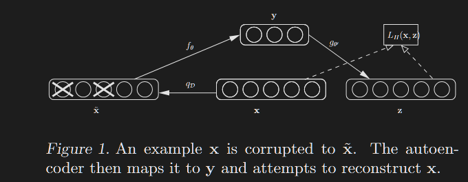
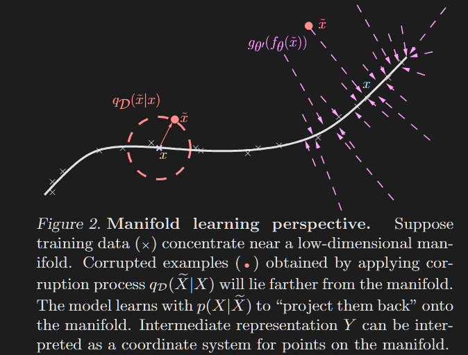

# Denoising Autoencoders

## Introduction

Theory: Deeper network  ==> Better generalization performance.

Practice:

- Learning proven to be difficult
- "Explaining Away" problem during inference

```
Explaining Away Problem

In deep generative models (a type of directed graphical models), hidden variables are assumed independent a priori but become dependent post-evidence due to multiple paths "explaining" the data.

Eg. If an alarm (observed node) could be caused by burglary or earthquake (two hidden parents), observing the alarm links their probabilities—evidence for one "explains away" the need for the other.

How does this affect inference?

Exact inference requires computing p(hidden|observed), but explaining away demands summing over exponentially many configurations in deep structures, leading to intractable partition functions (sum/integral of all cases).

This scales poorly with depth, thereby requiring the need for approximations like MCMC  or variational approach.
```

Another Issue is that of **Difficult Optimization**  (vanishing/exploding gradients leading to local minima)

Solution:  An unsupervised training criterion to perform a layer-by-layer initialization.

Each layer is at first trained to produce a higher level (hidden) representation of the observed patterns, based on the representation it receives as input from the layer below, by optimizing a local unsupervised criterion.

Each level produces a representation of the input pattern that is more abstract than the previous (because it is obtained by composing more operations).

This yields a starting point (latent space), rom which a global fine-tuning of the model’s parameters is then performed using another training criterion appropriate for the task at hand. 

Empirically proven to avoid local suboptimal minimas.

Unsupervised Approach is "good" at producing intermediate representations of the input

BUT

What constitutes a "good" representation for initializing deep nets.

More formally,

**What explicit criteria a  good intermediate representation should satisfy**

- Retain certain information from input while constrain itself to a given form. Eg. a real-valued vector of a given size in the case of an autoencoder
- Sparsity of representation

### Additional Specific Criterion:

- Robustness to partial destruction of the input (partially destroyed input should yield almost the same representation.

**Motivation:**

A good representation is expected to capture stable structures in the form of dependencies and regularities characteristic of the (unknown) distribution of its observed input.

**Analogy:**

Human ability to recognize partially occluded or corrupted images. 

## Algorithm Description

### Setup

$X, Y$ => 2 random variables

$p(X,Y)$ => joint probability density of X and Y

$p(X), p(Y)$ => marginal distributions. 

$\mathbb{E}_{p(X)} | f(X)| = \int p(x)f(x)dx$ => Expectation

$\mathbb{H} (X) = \mathbb{H} (p) = \mathbb{E}_{p(X)} | - log \, p(X)|$ => Entropy

$\mathbb{H} (X | Y) = \mathbb{E}_{p(X, Y)} | - log \, p(X|Y)|$ => Conditional Entropy

$\mathbb{D}_{KL} (p || q) = \mathbb{E}_{p(X)} [log \, \frac {p(X)}{q(X)}]$ => Kullback Leibler Divergence

$\mathbb{H} (p || q)  = \mathbb{E}_{p(X)} [- log \, q(X)] = \mathbb{E}_{p(X)} + \mathbb{D}_{KL} (p || q)$ => Cross Entropy

$\mathbb{I} (X ; Y) = \mathbb{H} (X) - \mathbb{H} (X | Y)$ => Mutual Information

$s(x) = \frac{1}{1 + e^{-x}}$ and $s(x) = (s(x_1), ... , s(x_d))^T$ => Sigmoid

$\mathcal{B}_\mu (x)$ and $\mathcal{B}_\mu (x) = (\mathcal{B}_{\mu_1} (x_1), . . . , \mathcal{B}_{\mu_d} (x_d))$ => Bernoulli Distribution

Typical Supervised Learning Setup:

$n$ pairs of (input, target)

$D_n = \{ (x^{(1)}, t^{(1)}), . . . , (x^{(n)}, t^{(n)}) \}$ is an i.i.d sample from an unknown distribution $q(X, T)$ with corresponding marginals $q(X)$ and $q(T)$

### Basic Autoencoder

An autoencoder takes input vector $x \isin [0, 1]^d$ and first it maps it to a hidden representation $y \isin [0, 1]^d$ through deterministic mapping $y = f_\theta(x) = s(Wx + b)$ parameterized by $\theta = \{W, b\}$ where $W$ is a  $d' \times d$ matrix and $b$ is bias vector.

This latent representation is then mapped back to a "reconstructed" vector $z \isin [0, 1]^d$ in input space $z = g_{\theta'} (y) = s(W' y + b')$ with $\theta' = \{W', b'\}$

Optional Constraint: $W' = W^T$ ==> autoencoder has tied weights.

Thus,

$$
x^{(i)} --> y^{(i)} --> z^{(i)}
$$

This is then trained to minimize *average reconstruction error*:

$$
\theta^* \, ,  \, \theta'^* = \argmin\limits_{\theta , \theta'} \frac {1}{n} \sum_{i=1}^n L(x^{(i)}, z^{(i)} ) =   \argmin\limits_{\theta , \theta'} \frac {1}{n} \sum_{i=1}^n L(x^{(i)}, g_{\theta'}(f_\theta(x^{(i)})) )
$$

where L is loss function such as traditional squared error $L(x, z) = ||x - z||^2$

Alternative loss, suggested by interpretation of x and z as either bit vectors or vectors of bit probabilities (Bernoulli) is the **reconstruction cross-entropy**

$$
\mathbb{L}_{\mathbb {H}} (x, z) = \mathbb{H} (\mathcal{B}_x || \mathcal{B}_z) = - \sum_{k=1}^d [x_k log \, z_k + (1-x_k) log \, (1 - z_k) ]
$$

So if input x is binary, $\mathbb{L}_{\mathbb {H}} (x, z)$ is negative log likelihood for the example x, given bernoulli parameters z
Thus,

$$
\theta^* \, ,  \, \theta'^* = \argmin\limits_{\theta , \theta'} \mathbb{E}_{q^0(X)} [\mathbb{L}_{\mathbb{H}} (X, g_{\theta'}(f_\theta(X)))]
$$

where $q^0 (X)$ denotes empirical distribution associated to our inputs. 

This optimization carried out by SGD.

### Denoising Autoencoder

To enforce robustness to partially destroyed inputs, We now train the model to reconstruct a clean "repaired" input from a corrupted, partially destroyed one.

This is done by first corrupting the initial input $x$ to get a partially destroyed version $\tilde x$ by means of stochastic mapping $\tilde x$ ~ $q_\mathcal{D} (\tilde x | x)$

This corruption process is parameterized by a desired proportion $v$ of "destruction""

- For each input $x$, a fixed number $vd$ of components are chosen at random, and their value is forced to 0, while others are left untouched.
- Thus, the autoencoder will be trained to "fill in" these artificially introduced "blanks"

The corrupted input $\tilde x$ is then mapped, as with basic autoencoder to a hidden representation $y = f_\theta(\tilde x) = s(W \tilde x + b)$ from which we reconstruct $z = g_{\theta'}(y) = s(W'y + b')$

Similarly to before, the parameters are trained to minimize the average reconstruction error $\mathbb{L}_{\mathbb{H}}(x, z) = \mathbb{H} (\mathcal{B_x} || \mathcal{B_z})$ over a training set to have z as close as possible to corrupted input x.

**Key Difference:** 

- z is now a deterministic function of  $\tilde x$ rather than x and thus the result of a stochastic mapping of x.





Let's define joint distribution
$$
q^0 (X, \tilde X, Y) = q^0(X) q_\mathcal{D} (\tilde X | X) \delta_{f_\theta(\tilde X)} (Y)
$$

where $\delta_u(v)$ puts mass 0 when $u \ne v$

Thus Y is a deterministic function of $\tilde X$.

The objective function then becomes,

$$
\argmin\limits_{\theta , \theta'} \mathbb{E}_{q^0(X, \tilde X)} [\mathbb{L}_{\mathbb{H}} (X, g_{\theta'} (f_\theta(\tilde X)))]
$$

So from SGD pov, in addition to picking up an input sample from training set, we also produce a random corrupted version of it and take step towards reconstructing the uncorrupted version from the corrupted version.

### Layer Wise Initialization and Finetuning

Basic autoencoder has been used as a building block to train deep nets. with representation of $k$-th layer used as input for $(k+1)$-th layer.

After a few layers have been trained, parameters are used as initialization for network optimized wrt supervised training criterion.

Thus, process to train deep net using denoising autoencoder is similar, only difference is how each layer is trained i.e minimize the criterion of denoising autoencoder instead of basic autoencoder

> Corruption process $q_\mathcal{D}$ is used only during training, but not for propagating representations from raw input to higher level representations.

> When layer k is trained, it receives as input the uncorrupted output of the previous layers.

## Relation to other approaches

#### Roots of the concept

Denoising Autoencoder involves learning to recover a clean input from a corrupted version.

This idea was introduced much earlier in 1987, as an alternative to Hopfield models.

Our objective though, is not *creating a competitive denoising algorithm*, but to **investigate explicit robustness to corrupting noise as a novel criterion guiling the learning of suitable intermediate representations to initialize a deep network**

Thus, out **corruption + denoising** is applied not only to input but also recursively to intermediate representations.

$$
Original \, Input --> Corrupt --> Denoise --> Send \, to \, next \, layer --> Corrupt --> Denoise --> Send \, to \, next \, layer --> and \, so \, on.
$$

#### Train Time Augmentation

This approach also somewhat similar to *augmenting training data* with stochastically transformed patterns. Eg. rotation, translation, scaling, etc. This has shown to improve performance

But our approach does not use any prior info about image topology nor does it produce extra labeled examples for supervised training.

We use corrupted patterns in a *generic (not specific to images)* unsupervised initialization step, while the supervised training phase used unmodified original data.

#### Regularization

There is a well known link b/w "training with noise" and "regularization": they are equivalent for small additive noise.

But our corruption process is a **large non-additive, destruction** of information.

We train autoencoders to fill in the blanks, not merely smooth the function (regularization).

Also regularization (eg. weight decay) does not improve performance as much as **corruption+denoising** does.

#### Handling Missing Data

One objection to this proposal can be: If our goal is to handle missing values correctly, we could have more naturally defined a proper latent variable generative model, and infer the posterior over the latent (hidden) representation in the presence of missing inputs.

But this requires a costly marginalization (sum over all cases).

By contrast, Our approach tries to learn a fast and robust deterministic mapping $f_\theta$ from examples of already corrupted inputs.

Thus, the burden shifts on **learning a constrained mapping** rather than unconstrained inference.

This forces the model to capture implicit invariances in the data.

## Analysis of Denoising Autoencoders

Alternative Perspectives on the algorithm

### Manifold Learning

The process of mapping a corrupted example to an uncorrupted one can be visualized with a low-dimensional manifold near which the data concentrate.



We learn a stochastic operator $p(X|\tilde X) = \mathcal{B}_{g_{\theta'}(f_\theta(\tilde X))} (X)$ that maps an $\tilde X$ to X.

The corrupted examples will be much more likely to be outside and farther from the manifold than the uncorrupted ones. 

Hence the stochastic operator $p(X|\tilde X)$ learns a map that tends to go from lower probability points $\tilde X$ to higher probability points $X$, generally on or near the manifold

> When $\tilde X$ is farther from manifold $p(X|\tilde X)$ should learn to make bigger steps to reach the manifold.

The denoising autoencoder can thus be seen as a way to define and learn a manifold.

The intermediate representation $Y = f(X)$ can be interpreted as a coordinate system for points on the manifold (this is most clear if we force the dimension of Y to be smaller than the dimension of X).

More generally, Y can be seen as a representation of X which is well suited to capture main variations in the data.

### Generative Model 

Consider the generative model 

$p(X, \tilde X, Y) = p(Y)p(X|Y)p(\tilde X | X)$ 

where 
- $p(X|Y) = \mathcal{B}_{s(W'Y + b')}$
- $p(\tilde X | X) = q_\mathcal{D} (\tilde X | X)$.
- $p(Y)$ is a uniform prior over $Y \isin [0,1]^d$

This defines a generative model with parameter set $\theta' = \{ W', b'\}$

We use the previously defined $q^0 (X, \tilde X, Y) = q^0(X) q_\mathcal{D} (\tilde X | X) \delta_{f_\theta(\tilde X)} (Y)$ as an auxillary model in the context of variational approximation of the log-likelihood $p(\tilde X)$

Note the following dependency structure

- $X --> \tilde X --> Y$ for $q$ or $q^0$
- $Y --> X --> \tilde X$ for p

Since p contains a corruption operation at the last generative stage, we fit $p(\tilde X)$ to corrupted training samples.

Performing Max Likelihood fitting on the samples drawn from $q^0(\tilde X)$ corresponds to minimizing the cross-entropy or maximizing

$$
\mathcal{H} = \max\limits_{\theta'} \{ - \mathbb{H} (q^0(\tilde X) || p(\tilde X))\} = \max\limits_{\theta'} \{ \mathbb{E}_{q^0(\tilde X)} [log \, p(\tilde X)] \}
$$

Let $q^*(X,Y | \tilde X)$ be a conditional density, then

$$
\mathcal{L}\left(q^{\star}, \widetilde{X}\right)=\mathbb{E}_{q^{\star}(X, Y \mid \widetilde{X})}\left[\log \frac{p(X, \widetilde{X}, Y)}{q^{\star}(X, Y \mid \widetilde{X})}\right]
$$

is a lower bound on $log \, p(\widetilde{X})$ since the following can be shown to be true for any $q^*$

$$
\log p(\tilde{X})=\mathcal{L}\left(q^{\star}, \tilde{X}\right)+\mathbb{D}_{\mathrm{KL}}\left(q^{\star}(X, Y \mid \tilde{X}) \| p(X, Y \mid \tilde{X})\right)
$$

Also it's easy to verify that bound is tight when $\mathbb{D}_{\mathrm{KL}}$ is  0.

We can thus write $log \, p(\tilde X) = max_{q^\star} \mathcal{L} (q^\star, \tilde X)$  and consequently rewrite

$$
\begin{aligned}
\mathcal{H} & =\max _{\theta^{\prime}}\left\{\mathbb{E}_{q^0(\widetilde{X})}\left[\max _{q^{\star}} \mathcal{L}\left(q^{\star}, \widetilde{X}\right)\right]\right\} \\
& =\max _{\theta^{\prime}, q^{\star}}\left\{\mathbb{E}_{q^0(\widetilde{X})}\left[\mathcal{L}\left(q^{\star}, \widetilde{X}\right)\right]\right\}
\end{aligned}
$$

where we moved maximization outside expectation because an unconstrained $q^\star (X, Y | \tilde X)$ can in principle perfectly model the conditional distribution needed to maximize $ \mathcal{L} (q^\star, \tilde X)$ for ant $\tilde X$

Now, if we replace maximization over an unconstrained $q^\star$ by the maximization over parameters $\theta$ of our $q^0$ (appears in $f_\theta$ that maps x to y), we get the lower bound on $\mathcal{H}$

$$
\mathcal{H}: \mathcal{H} \geq \max _{\theta^{\prime}, \theta}\left\{\mathbb{E}_{q^0}(\widetilde{X})\left[\mathcal{L}\left(q^0, \widetilde{X}\right)\right]\right\}
$$

Maximizing on this lower bound, we find:

$$
\begin{aligned}
& \underset{\theta, \theta^{\prime}}{\arg \max }\left\{\mathbb{E}_{q^0(\widetilde{X})}\left[\mathcal{L}\left(q^0, \widetilde{X}\right)\right]\right\} \\
= & \underset{\theta, \theta^{\prime}}{\arg \max } \mathbb{E}_{q^0(X, \widetilde{X}, Y)}\left[\log \frac{p(X, \widetilde{X}, Y)}{q^0(X, Y \mid \widetilde{X})}\right] \\
= & \underset{\theta, \theta^{\prime}}{\arg \max } \mathbb{E}_{q^0(X, \widetilde{X}, Y)}[\log p(X, \widetilde{X}, Y)] \\
& \quad+\mathbb{E}_{q^0(\widetilde{X})}\left[\mathbf{H}\left[q^0(X, Y \mid \widetilde{X})\right]\right] \\
= & \underset{\theta, \theta^{\prime}}{\arg \max } \mathbb{E}_{q^0(X, \widetilde{X}, Y)}[\log p(X, \widetilde{X}, Y)] .
\end{aligned}
$$
> $\theta$ only occurs in $Y=f_\theta(X)$, and $\theta^{\prime}$ only occurs in $p(X \mid Y)$. The last line is therefore obtained because $q^0(X \mid \widetilde{X}) \propto q_{\mathcal{D}}(\widetilde{X} \mid X) q^0(X)$ (none of which depends on $\left(\theta, \theta^{\prime}\right)$ ), and $q^0(Y \mid X)$ is deterministic, i.e., its entropy is constant, irrespective of $\left(\theta, \theta^{\prime}\right)$. 

> Hence the entropy of $q^0(X, Y \mid \widetilde{X})=q^0(Y \mid \widetilde{X}) q^0(X \mid \widetilde{X})$, does not vary with $\left(\theta, \theta^{\prime}\right)$. 

Finally, from all this we get our training criterion

$$
\begin{aligned}
& \underset{\theta, \theta^{\prime}}{\arg \max } \mathbb{E}_{q^0(\widetilde{X})}\left[\mathcal{L}\left(q^0, \widetilde{X}\right)\right] \\
= & \underset{\theta, \theta^{\prime}}{\arg \max } \mathbb{E}_{q^0(X, \widetilde{X}, Y)}[\log [p(Y) p(X \mid Y) p(\widetilde{X} \mid X)]] \\
= & \underset{\theta, \theta^{\prime}}{\arg \max } \mathbb{E}_{q^0(X, \widetilde{X}, Y)}[\log p(X \mid Y)] \\
= & \underset{\theta, \theta^{\prime}}{\arg \max } \mathbb{E}_{q^0(X, \widetilde{X})}\left[\log p\left(X \mid Y=f_\theta(\widetilde{X})\right)\right] \\
= & \underset{\theta, \theta^{\prime}}{\arg \min } \mathbb{E}_{q^0(X, \widetilde{X})}\left[L_{\mathbf{H}}\left(X, g_{\theta^{\prime}}\left(f_\theta(\widetilde{X})\right)\right)\right]
\end{aligned}
$$

where the third line is obtained because $(\theta, \theta')$ have no influence on $\mathbb{E}_{q^0(X, \widetilde{X}, Y)}[\log p(Y)]$

And the last line is obtained by inspection of definition of $\mathbb{L}_{\mathbb{H}}$ when $p\left(X \mid Y=f_\theta(\widetilde{X})\right) \text { is a } \mathcal{B}_{g_{\theta^{\prime}}\left(f_\theta(\widetilde{X})\right)}$


### Other Perspectives

#### Information Theory

Consider $X$ ~ $q(X)$ with q unknown and $Y = f_\theta (\tilde X)$.

It can bed shown that minimizing the expected reconstruction error amounts to maximizing a lower bound on mutual information $\mathbb{I} (X;Y)$

Denoising autoencoders can thus be justified by the objective that Y captures as much information as possible about X even as Y is a function of corrupted input.

#### Stochastic Operator

Extending the manifold perspective, the denoising autoencoder can also be seen as corresponding to a semi-parametric model from which we can sample:

$$
p(X)=\frac{1}{n} \sum_{i=1}^n \sum_{\tilde{\mathbf{x}}} p(X \mid \widetilde{X}=\tilde{\mathbf{x}}) q_{\mathcal{D}}\left(\tilde{\mathbf{x}} \mid \mathbf{x}_i\right),
$$

## Experiments

The experiments evaluated the proposed algorithm—**Stacked Denoising Autoencoders (SdA-3)**—on the **Larochelle et al. (2007)** benchmark, which includes several **MNIST variants** (rotated digits, random backgrounds, image backgrounds, and combinations) as well as binary shape classification tasks (convex, rect, rect-img).  

Each task had **10k training**, **2k validation**, and **50k test** examples. Models were trained with various hyperparameters (noise fraction \( \nu \), layer sizes, training epochs) and chosen based on **validation performance** with **early stopping**.  

Results showed that **SdA-3 outperformed or matched** previous methods—**SVMs, DBNs, and stacked autoencoders (SAA-3)**—on nearly all tasks. The **denoising process** yielded significantly better feature representations, especially with **overcomplete first layers (~2000 units)**, enabling learning of more meaningful and distributed features compared to standard autoencoders.  

Visualizations of the learned filters confirmed that **adding noise during training encourages more useful, larger-scale feature detectors**, validating the advantage of the denoising approach.

## Conclusion

Unsupervised initialization of layers with an explicit denoising criterion helps to capture interesting structure in the input distribution. 

This in turn leads to intermediate representations much better suited for subsequent learning tasks such as supervised classification.

